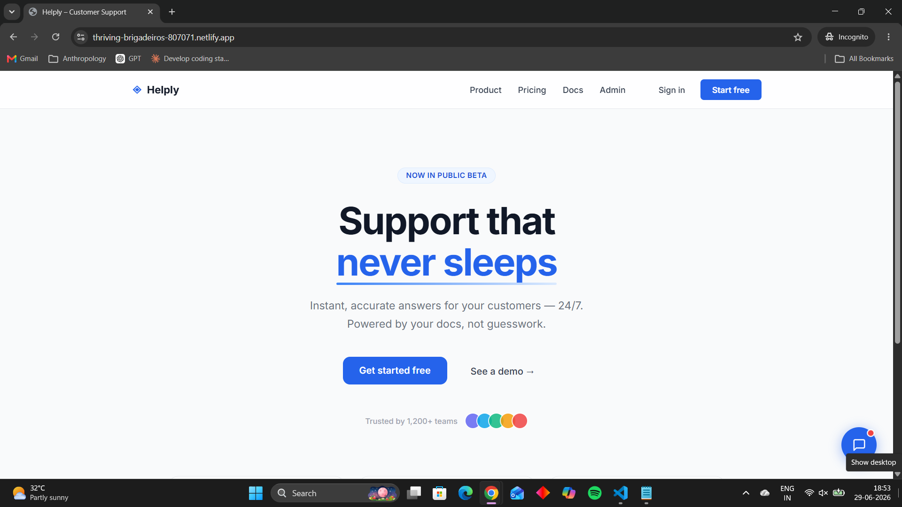
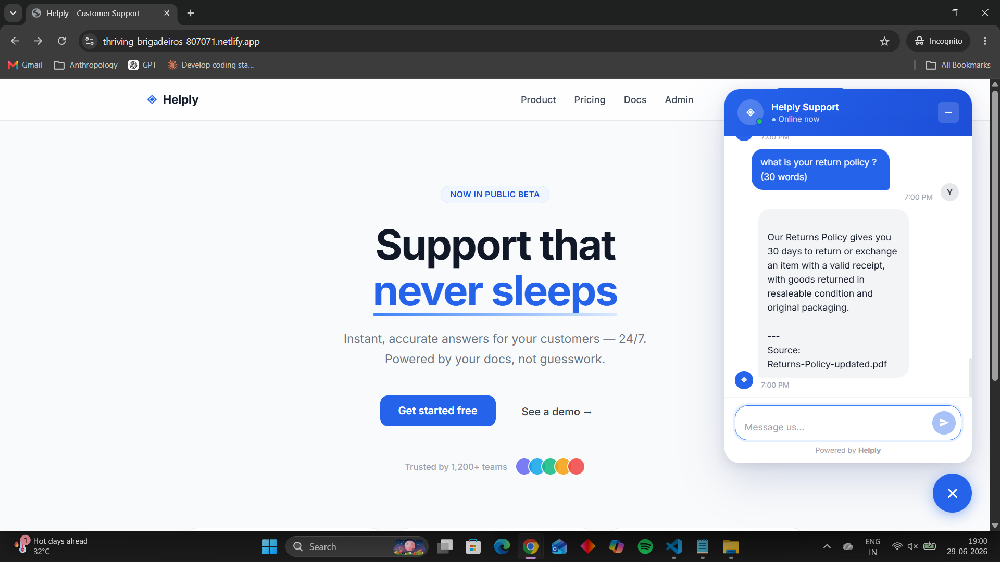
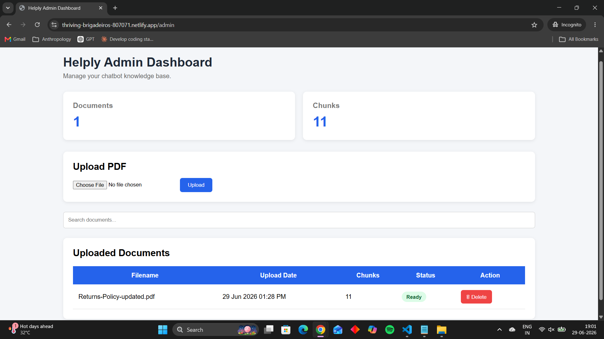
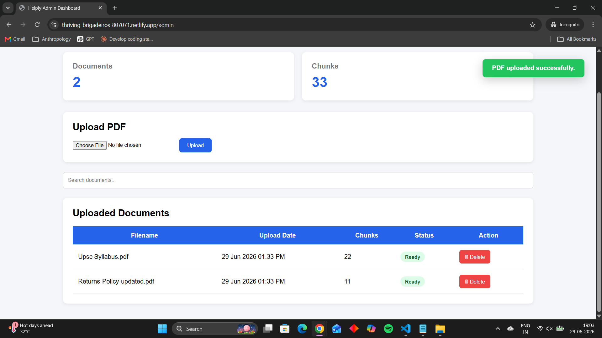
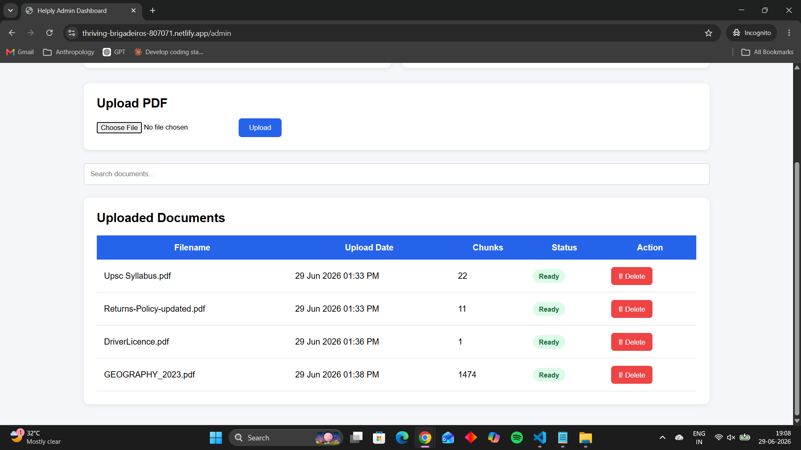
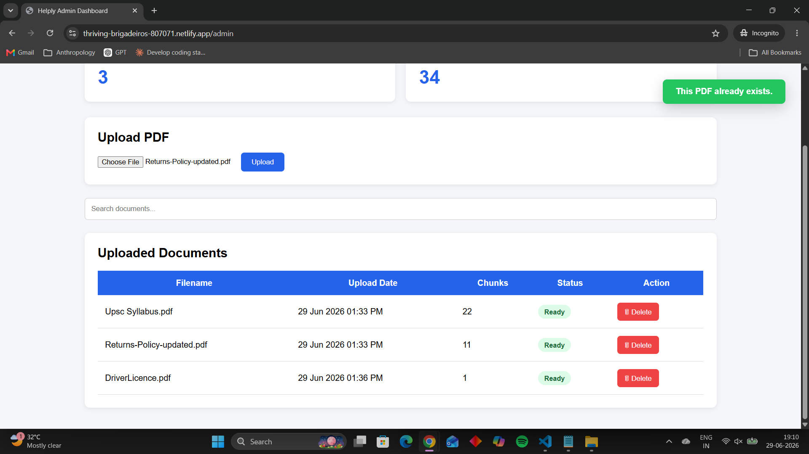
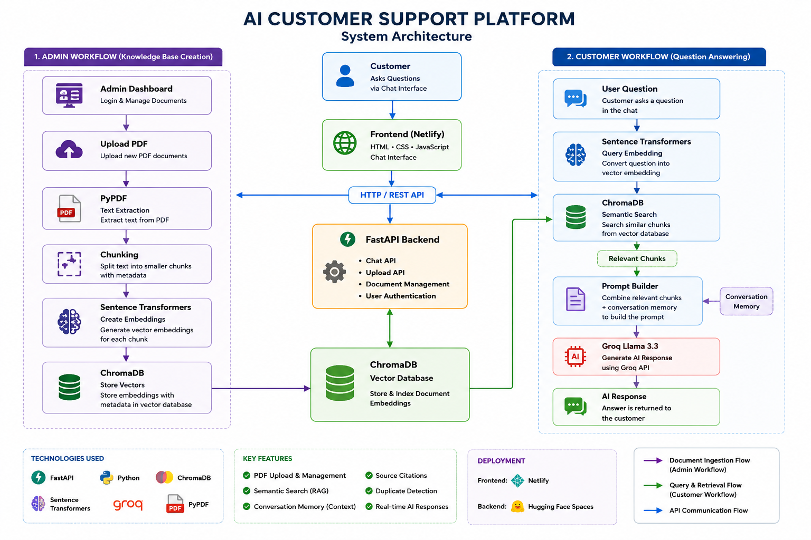

# 🤖 AI Customer Support Platform


> A production-ready AI Customer Support Platform powered by **FastAPI**, **Groq LLM**, and **Retrieval-Augmented Generation (RAG)** that enables businesses to create an AI-powered customer support assistant from their own PDF documents.

---

## 🚀 Live Demo

### 🌐 Frontend

https://thriving-brigadeiros-807071.netlify.app/

### ⚡ Backend API

https://sabarish22122-ai-customer-support-platform.hf.space/

### 📖 Swagger API Documentation

https://sabarish22122-ai-customer-support-platform.hf.space/docs

### 💻 GitHub Repository

https://github.com/sabarishwarne2001/ai-customer-support-platform

---

# 📌 Business Problem

Businesses receive the same customer questions repeatedly.

Traditional chatbots require manually writing hundreds of FAQs, which become difficult to maintain whenever company information changes.

---

# ✅ Solution

This platform allows administrators to upload company PDF documents and instantly create an AI-powered customer support assistant.

Instead of relying on predefined answers, the assistant searches the uploaded knowledge base using Retrieval-Augmented Generation (RAG) and generates accurate, context-aware responses.

---

# ✨ Features

* 🤖 AI-powered customer support chatbot
* 📄 Upload company PDF documents
* 🧠 Retrieval-Augmented Generation (RAG)
* 🔍 Semantic search using vector embeddings
* 💬 Conversation memory
* 📚 Source citation with every response
* 📋 Knowledge base management dashboard
* 🗂 View uploaded documents
* ❌ Delete documents from the knowledge base
* 📊 Knowledge base statistics
* ⚡ FastAPI REST API
* 🌐 Responsive web interface
* ☁️ Cloud deployment

---

## 🖼 Screenshots

### Landing Page



---

### Customer Chat



---

### Admin Dashboard



---

### Upload PDF



---

### Knowledge Base



---

### Duplicate PDF Detection



---

# 🏗 System Architecture



Customer

↓

Frontend (HTML • CSS • JavaScript)

↓

FastAPI Backend

↓

RAG Engine

↓

ChromaDB

↓

Groq LLM

↓

AI Response

---

# 🛠 Technology Stack

## Frontend

* HTML
* CSS
* JavaScript

## Backend

* FastAPI
* Python

## AI

* Groq API
* Llama 3.3
* Sentence Transformers

## Vector Database

* ChromaDB

## PDF Processing

* PyPDF

## Deployment

* Netlify
* Hugging Face Docker Spaces

---

# 📂 Project Structure

```text
frontend/
backend/

├── api
├── rag
├── vector_store
├── uploads
├── requirements.txt
└── main.py
```

---

# 🔌 API Endpoints

| Method | Endpoint              | Description               |
| ------ | --------------------- | ------------------------- |
| GET    | /                     | API Status                |
| GET    | /health               | Health Check              |
| POST   | /chat                 | Ask AI Questions          |
| POST   | /upload               | Upload PDF                |
| GET    | /documents            | List Uploaded PDFs        |
| GET    | /stats                | Knowledge Base Statistics |
| DELETE | /documents/{filename} | Delete PDF                |

---

# ⚙ Installation

```bash
git clone https://github.com/sabarishwarne2001/ai-customer-support-platform.git

cd ai-customer-support-platform
```

Install dependencies

```bash
pip install -r requirements.txt
```

Create a `.env` file

```env
GROQ_API_KEY=your_api_key
```

Run the backend

```bash
uvicorn main:app --reload
```

---

# 🎯 Future Improvements

* User authentication
* Role-based access control
* Streaming AI responses
* Multi-language support
* Analytics dashboard
* Conversation history
* Docker Compose deployment

---

# 👨‍💻 Author

**Sabarish**

Aspiring AI Automation Developer focused on building AI-powered business solutions using FastAPI, RAG, and Large Language Models.

---

# ⭐ If you found this project useful, consider giving it a star.

